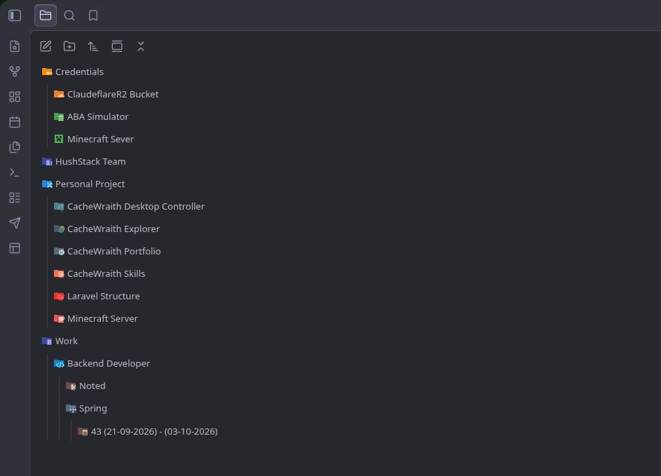
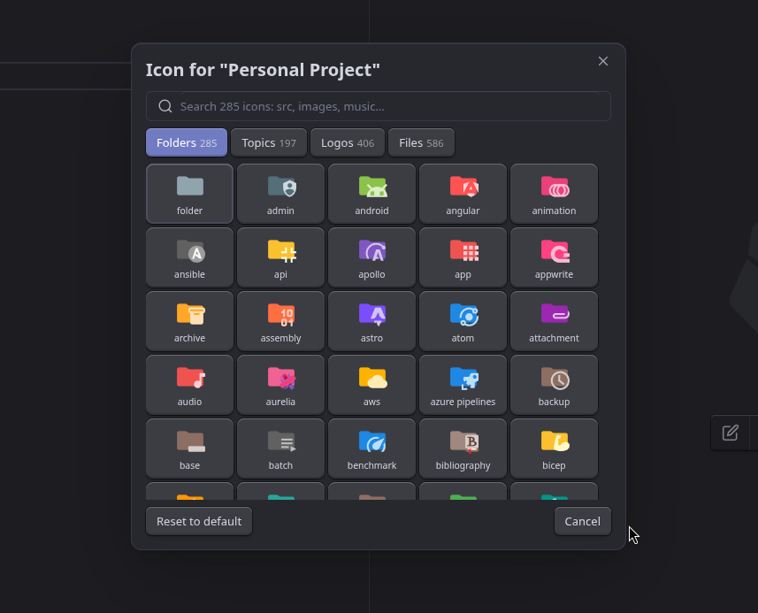
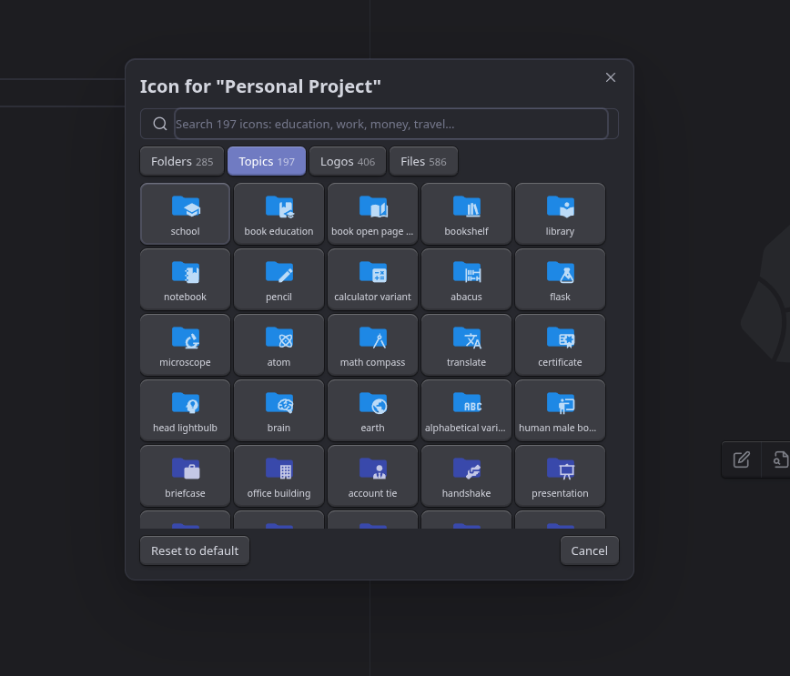
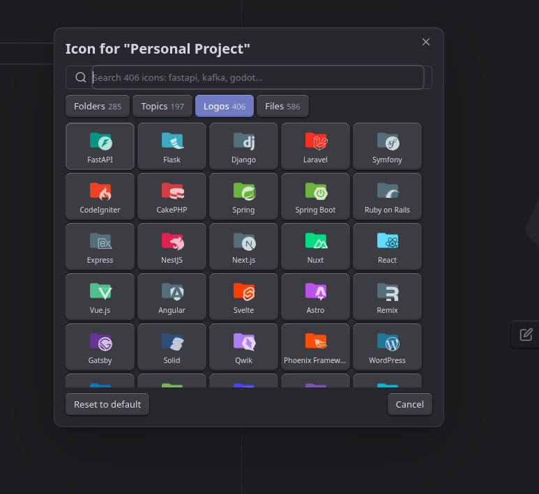
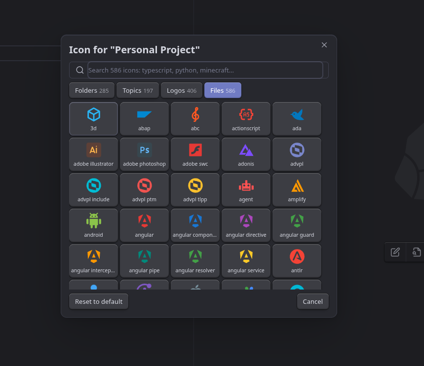

<h1 align="center">Shard Icons</h1>

  <strong>Folder and file icons for the Obsidian file explorer, in the style of VS Code's Material Icon Theme.</strong>

  
  
  

  <a href="https://obsidian.md/plugins?id=shard-icons"><strong>Install in Obsidian</strong></a>
  ·
  <a href="#the-picker">See the icons</a>
  ·
  <a href="#using-it">How to use it</a>

  

## Highlights

- **1,474 icons in four sets.** The Material Icon Theme's folders and file icons, everyday topic
  folders, and 406 brand-logo folders, all drawn in one consistent style.
- **Matched automatically.** `src`, `docs`, `images`, `.github`, `work`, `money`, `travel` and a
  few thousand other folder names get the right icon with no setup.
- **Any icon, anywhere.** A file can wear a folder icon or a logo, and a folder a file icon.
- **Made to fit your theme.** The icon takes the place of the one your theme draws instead of
  sitting beside it, and uses the Material Icon Theme's light variants in light mode.
- **Private and offline.** No network requests, no telemetry: every icon ships inside the plugin.

## The picker

Right-click any folder or file → **Change icon…**, then search or pick from four tabs.

<table>
  <tr>
    <td width="50%" align="center">
      
       <strong>Folders</strong> · 285
       The Material Icon Theme's own folder icons: src, docs, tasks, server…
    </td>
    <td width="50%" align="center">
      
       <strong>Topics</strong> · 197
       Everyday folders in a topic's color: education, work, money, travel…
    </td>
  </tr>
  <tr>
    <td width="50%" align="center">
      
       <strong>Logos</strong> · 406
       Folders in a brand's color with its logo: FastAPI, Kafka, Jira, Counter-Strike…
    </td>
    <td width="50%" align="center">
      
       <strong>Files</strong> · 586
       The Material Icon Theme's file icons: TypeScript, Python, Minecraft…
    </td>
  </tr>
</table>

The picker opens on Folders for a folder and on Files for a file. The icon the theme would have
guessed from the name is shown first, badged `match`.

## Install

### From Community Plugins

_Settings → Community plugins → Browse_, search for **Shard Icons**, then _Install_ and
_Enable_. Or open the [plugin page](https://obsidian.md/plugins?id=shard-icons) and it will take
you there.

### With BRAT

To follow releases the moment they are tagged:

1. Install **BRAT** from Community Plugins.
2. _BRAT → Add beta plugin_ → `https://github.com/cachewraith/shard-icons`.
3. Enable **Shard Icons** in _Settings → Community plugins_.

### Manually

Download `main.js`, `manifest.json` and `styles.css` from the
[latest release](https://github.com/cachewraith/shard-icons/releases/latest) into
`<your vault>/.obsidian/plugins/shard-icons/`, then reload Obsidian.

## Using it

- **Change an icon** — right-click a folder or file in the file explorer → _Change icon…_.
  Search, or switch tabs with the mouse; the arrow keys move through the grid,
  <kbd>Enter</kbd> picks and <kbd>Esc</kbd> closes.
- **Reset one folder or file** — right-click → _Reset icon to default_, or _Reset to default_ in
  the dialog.
- **From the keyboard** — the commands _Change icon of the active file_ and _Change icon of the
  active file's folder_ open the same dialog for whatever note you are in.
- **Automatic icons** — folders you have not touched are matched by name; files can be matched by
  name and extension too, if you turn that on. An icon you chose yourself always wins.
- **Renaming and moving** keeps icons, including everything inside a folder. Deleting drops
  them.

## Settings

| Setting                | Default | What it does                                                |
| ---------------------- | ------- | ----------------------------------------------------------- |
| Automatic folder icons | on      | Folders with no chosen icon get one matched from their name |
| File icons             | off     | Files with no chosen icon get one from name and extension   |
| Icon size              | 16 px   | Between 12 and 28                                           |
| Clear all custom icons | —       | Asks first; cannot be undone                                |

## Your data

Everything lives in `.obsidian/plugins/shard-icons/data.json`: your settings and which folder
or file has which icon. Nothing else is stored, and the plugin makes no network requests and
collects nothing.

An icon this version does not recognise — from a newer release, from a vault synced the other
way, or a symbol icon from before 0.4.0 — shows as a plain folder or file and is **kept**, not
deleted.

## Contributing

Issues and pull requests are welcome. Building, testing and releasing are covered in
[`docs/`](docs/): [development](docs/development.md) and [releasing](docs/releasing.md).

## Licenses

This plugin is MIT (see [`LICENSE`](LICENSE)). The icons it bundles are not:

- **Material Icon Theme** — MIT, © Philipp Kief and contributors.
  [`licenses/material-icon-theme-LICENSE.txt`](licenses/material-icon-theme-LICENSE.txt)
- **Simple Icons** — CC0-1.0. [`licenses/simple-icons-LICENSE.md`](licenses/simple-icons-LICENSE.md)
- **Material Design Icons** — Apache-2.0, by Pictogrammers.
  [`licenses/material-design-icons-LICENSE.txt`](licenses/material-design-icons-LICENSE.txt)

Brand logos are trademarks of their respective owners; the CC0 waiver covers the icon files,
not the marks. See [`licenses/`](licenses/) for the full notices.
